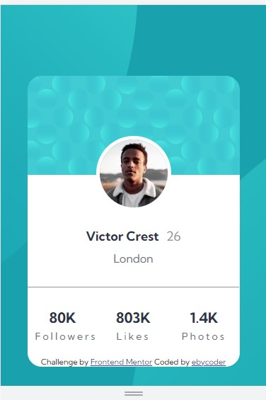
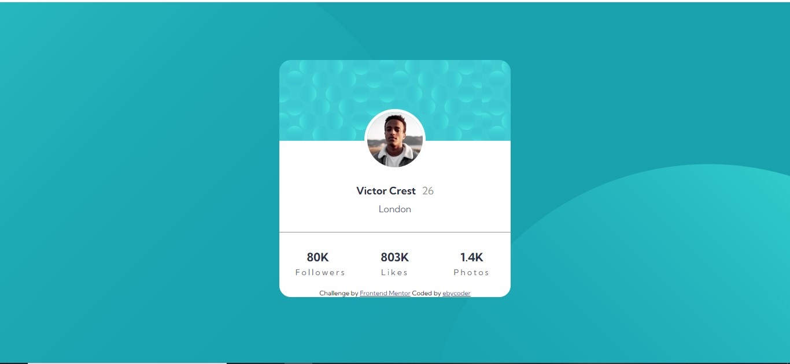

# Frontend Mentor - Profile card component solution

This is a solution to the [Profile card component challenge on Frontend Mentor](https://www.frontendmentor.io/challenges/profile-card-component-cfArpWshJ).  

## Table of contents

- [Overview](#overview)
  - [The challenge](#the-challenge)
  - [Screenshot](#screenshot)
  - [Links](#links)
- [My process](#my-process)
  - [Built with](#built-with)
  - [What I learned](#what-i-learned)
  - [Useful resources](#useful-resources)
- [Author](#author)

## Overview

### The challenge

- Build out the project to the designs provided

### Screenshot





### Links

- Solution URL: [Solution URL](https://github.com/eby-coder/Genius-orange.git)
- Live Site URL: [Add live site URL here](https://your-live-site-url.com)

## My process

### Built with

- Semantic HTML5 markup
- CSS custom properties
- Float
- CSS Grid

### What I learnt

For this challenge, I learnt a lot about backgrounds that I didn't know before. It was the biggest challenge for me. I learnt how to add mulitple backgrounds to a page and how to position them correctly. I learnt how to combine background images and colors. I'll be applying this knowledge to other things that I build.

New Code Snippets🎉

```css
body {
    background-color: var(--dark-cyan);
    background-image: url(./images/bg-pattern-top.svg),
                      url(./images/bg-pattern-bottom.svg);
    background-position: 190% -60%, -60% 20%;
    background-repeat: no-repeat;
}

.entire-page {
    background-image: url(./images/bg-pattern-card.svg);
    background-repeat: repeat-x;
    background-color: hsl(0, 0%, 100%);
    width: 400px;
    margin: 100px auto 0;
    border-radius: 20px;
    overflow: hidden;
    text-align: center;
    font-family: 'Kumbh Sans', sans-serif;
}
```

### Useful resources

- [Adding Multiple Backgrounds](https://www.svgbackgrounds.com/how-to-add-svgs-with-css-background-image/) - This site taught me how to add svg images as background, how to add multiple background images and how to position them separately.

## Author

- LinkedIn - [Ebere Ndukwu](https://www.linkedin.com/in/ebere-ndukwu-584722249/)
- Frontend Mentor - [@eby-coder](https://www.frontendmentor.io/profile/eby-coder)
